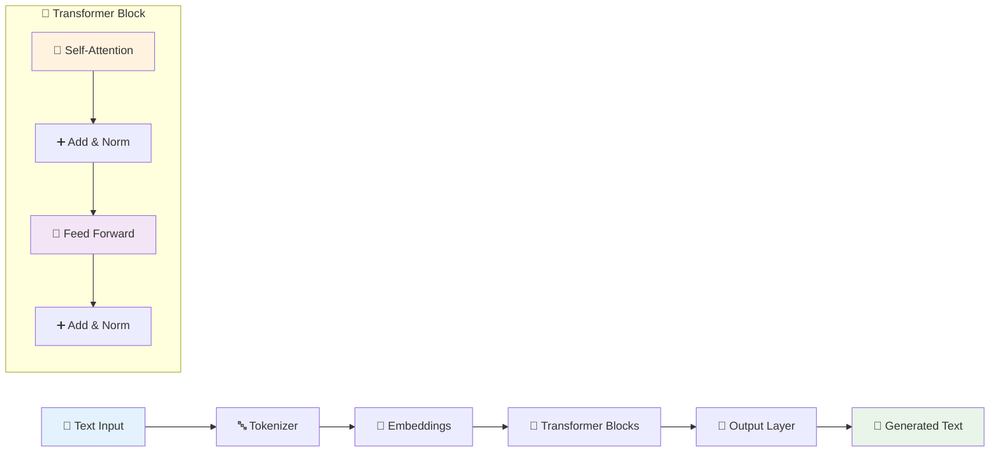

# 🤖 Small Language Model from Scratch
**Build and train your own GPT-style transformer from scratch in PyTorch**

[](https://colab.research.google.com/github/Yashjain0099/Small_Language_Model_from_Scratch/blob/main/SLM_(scratch).ipynb)
[](https://python.org)
[](https://pytorch.org)

---

## 📋 Table of Contents
- [🎯 What This Is](#-what-this-is)
- [✨ Key Features](#-key-features)
- [🏗️ How It Works](#️-how-it-works)
- [🚀 Quick Start](#-quick-start)
- [💻 Usage Examples](#-usage-examples)
- [📊 Results](#-results)
- [🛠️ Project Structure](#️-project-structure)
- [🤝 Contributing](#-contributing)

---

## 🎯 What This Is

A **complete GPT-style language model** built entirely from scratch using PyTorch. No black boxes - every component is implemented and explained.

**Perfect for:**
- 🎓 Learning how transformers actually work
- 🔬 Experimenting with language model architectures  
- 🚀 Building your own AI text generation projects

---

## ✨ Key Features

| Feature | Description | Status |
|---------|-------------|---------|
| 🧠 **Custom Transformer** | Multi-head attention, feed-forward networks, layer norm | ✅ Complete |
| 🔤 **Smart Tokenization** | GPT-2 BPE tokenizer via tiktoken | ✅ Complete |
| ⚡ **Fast Training** | Mixed precision, gradient accumulation, CUDA support | ✅ Complete |
| 🎨 **Text Generation** | Temperature sampling, top-k filtering | ✅ Complete |
| ☁️ **Colab Ready** | One-click deployment in Google Colab | ✅ Complete |

---

## 🏗️ How It Works



**The Process:**
1. **Tokenize** text using GPT-2's tokenizer
2. **Embed** tokens and add position information
3. **Transform** through multiple attention layers
4. **Generate** next token predictions
5. **Sample** from predictions to create new text

---

## 🚀 Quick Start

### Option 1: Google Colab (Recommended) ☁️
Click the badge above → Run all cells → Start generating text!

### Option 2: Local Setup 💻
```bash
# Clone the repo
git clone https://github.com/Yashjain0099/Small_Language_Model_from_Scratch.git
cd Small_Language_Model_from_Scratch

# Install dependencies  
pip install torch tiktoken numpy matplotlib tqdm

# Run the notebook
jupyter notebook SLM_\(scratch\).ipynb
```

---

## 💻 Usage Examples

### 🎯 Basic Text Generation
```python
# Load your trained model
model = SmallLanguageModel()
model.load_state_dict(torch.load('model.pth'))

# Generate text
prompt = "A little girl went to the woods"
output = model.generate(prompt, max_length=50, temperature=0.8)
print(output)
```

### 🎨 Creative vs Focused Generation
```python
# Creative mode (higher temperature)
creative = model.generate("Once upon a time", temperature=1.2, top_k=50)

# Focused mode (lower temperature)  
focused = model.generate("The capital of France is", temperature=0.3, top_k=10)
```

### 🔧 Training Your Own Model
```python
# Quick training setup
trainer = LanguageModelTrainer(model)
trainer.train(
    data_path="your_text_data.txt",
    batch_size=16,
    learning_rate=3e-4,
    epochs=5
)
```

---

## 📊 Results

### 📝 Sample Generation
**Input:** *"A little girl went to the woods"*

**Output:**
```
A little girl went to the woods and he was looking at the animals and he saw 
a little boy with a big smile on its face. He knew she would never bring 
medicine before. One day, the girl called Jeff went for a walk...
```

### 📈 Training Progress

*Model learns to predict text better over time*

### ⚡ Performance Stats
- **Model Size:** ~25M parameters
- **Training Time:** ~2 hours on GPU
- **Generation Speed:** 50+ tokens/second
- **Memory Usage:** <4GB GPU memory

---

## 🛠️ Project Structure

```
📦 Small-Language-Model
├── 📜 SLM_(scratch).ipynb    # Main notebook with everything
├── 📄 README.md              # This file
└── 📁 images/                # Screenshots and plots
    ├── training_progress.png
    ├── model_architecture.png
    └── generation_examples.png
```

### 🧩 Code Components

| Component | What It Does | Lines of Code |
|-----------|--------------|---------------|
| **Tokenizer** | Converts text ↔ numbers | ~50 lines |
| **Model** | Transformer architecture | ~200 lines |
| **Training** | Loss calculation & optimization | ~100 lines |
| **Generation** | Text sampling & generation | ~80 lines |

---

## 🎓 What You'll Learn

### 🔍 Core Concepts
- ✅ How self-attention actually works
- ✅ Why transformers are so powerful
- ✅ How language models generate text
- ✅ Modern training techniques (mixed precision, scheduling)

### 🧠 Technical Skills
- ✅ Building neural networks from scratch
- ✅ Implementing attention mechanisms
- ✅ Training large models efficiently
- ✅ Text generation and sampling methods

---

## 🎯 Model Configuration

```python
# Default model settings
MODEL_CONFIG = {
    'vocab_size': 50257,      # GPT-2 vocabulary
    'd_model': 512,           # Hidden dimension
    'n_heads': 8,             # Attention heads
    'n_layers': 6,            # Transformer layers
    'max_seq_len': 1024,      # Maximum sequence length
}
```

**Want bigger models?** Just increase the parameters:
- 📱 **Tiny:** 256 dim, 4 heads, 4 layers (~6M params)
- 🖥️ **Small:** 512 dim, 8 heads, 6 layers (~25M params)  
- 🚀 **Medium:** 768 dim, 12 heads, 12 layers (~85M params)

---

## 🔧 Advanced Features

### ⚡ Training Optimizations
- **Mixed Precision:** 2x faster training
- **Gradient Accumulation:** Larger effective batch sizes
- **Learning Rate Scheduling:** Warmup + cosine decay
- **Checkpointing:** Resume training anytime

### 🎨 Generation Options
- **Temperature:** Control randomness (0.1 = boring, 1.5 = wild)
- **Top-K:** Only sample from K most likely tokens
- **Max Length:** Control output length
- **Repetition Penalty:** Avoid repetitive text

---

## 🤝 Contributing

Found a bug? Want to add features? Contributions welcome!

1. **Fork** the repo
2. **Create** a feature branch
3. **Make** your changes  
4. **Submit** a pull request

**Ideas for contributions:**
- 🎯 Different attention mechanisms
- 📊 Better evaluation metrics
- 🎨 New generation techniques
- 📚 More example datasets
- 🐛 Bug fixes and improvements

---

## 📚 Learn More

### 📖 Helpful Resources
- [The Illustrated Transformer](http://jalammar.github.io/illustrated-transformer/) - Visual explanation
- [Attention Is All You Need](https://arxiv.org/abs/1706.03762) - Original paper
- [Let's Build GPT](https://www.youtube.com/watch?v=kCc8FmEb1nY) - Andrej Karpathy's tutorial

### 🎬 Video Walkthrough
*Coming soon: Full video explanation of the code!*

---

## 📞 Contact

**Yash Jain**
- 🐙 GitHub: [@Yashjain0099](https://github.com/Yashjain0099)
- 📧 Questions? Open an issue!

---

## ⭐ Show Your Support

If this helped you understand language models:
- ⭐ **Star** the repository
- 🍴 **Fork** for your experiments
- 📢 **Share** with friends
- 🐛 **Report** bugs you find

---

**Built with ❤️ for learning and understanding AI**

*Ready to dive in? Click the Colab badge and start experimenting!* 🚀
